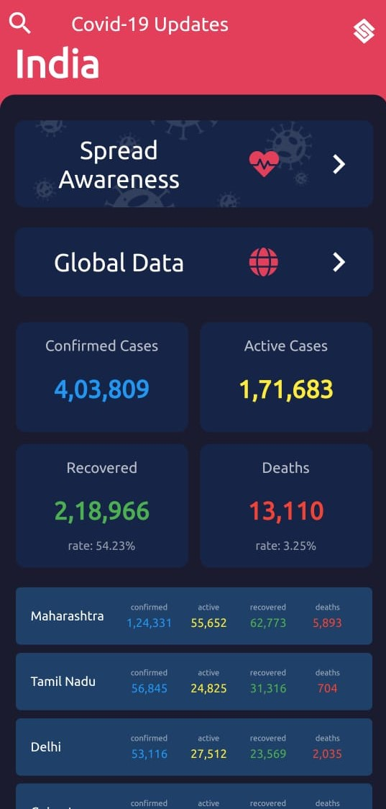
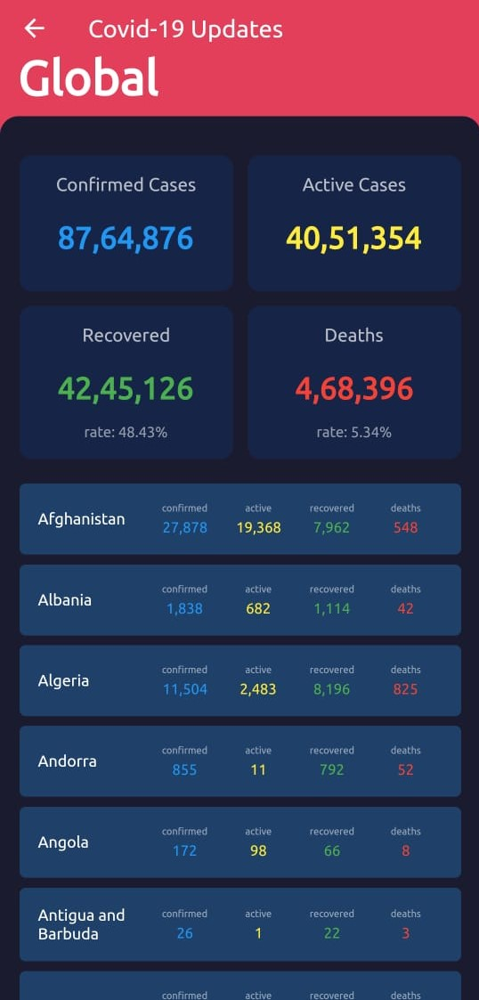
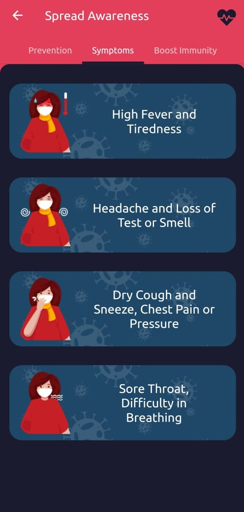
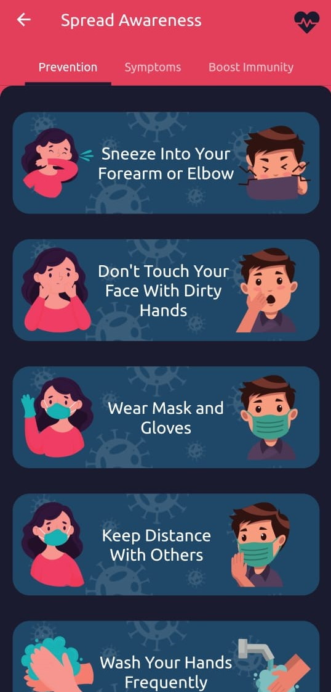

# COVID 19 Update Tracker

A Powerfull COVID Tracker for Tracing Activies, Including Symtoms Checkers and Immunity Booster Suggestions pages.

The aim of the app is to give latest numerical data of Covid19 Cases at fingertips.

## Snapshots
*     
*   
*  

### Information
* A application which contains widgets displaying total cases enrolled, death toll, recovered cases, and net active cases at present. It displays information regarding every states on this criteria in particular.
* The basic data source that retrieve information which is to be displayed is the api which provides latest and up to date information.This online source updates with all legal declaration and hence provides the most recent data statics till date.
The main problem before considering any information is to check the date of data being uploaded and hence many a times users are deprived of most recent facts. With this application user can scroll through different states and for a demo  the on click event gives widget for a particular state and a scroll down list displaying numeric data regionwise.

- Material UI
- Smooth Scroll UI
- Global Information
- India COVID 19 DATA Information
- State-Wise 
- District-Wise
- District Search For faster access
- Deep UI colors for reduce eye strain at night and day.
- Percentage rates of increasing and decreasing
- flash screen page
- Animation UI
- Simple and Clean UI
- High Response Rate
- Caches Inbuilt
- No Login required
- No permission Required expect internet connection
- Low in Size
- Design for Android and Iphones
- Clean and Simple Fonts
- Multi-Colors Fonts
- Divided into sections.

## Getting Started

This project is a starting point for a Flutter application.

A few resources to get you started if this is your first Flutter project:

- [Lab: Write your first Flutter app](https://flutter.dev/docs/get-started/codelab)
- [Cookbook: Useful Flutter samples](https://flutter.dev/docs/cookbook)

For help getting started with Flutter, view our
[online documentation](https://flutter.dev/docs), which offers tutorials,
samples, guidance on mobile development, and a full API reference.

*This Project is just for only Educational purpose only for learning new programming languages.and just uploading files only for helping any one.I'm not responsible of any kind of misuse and some other cases.
This is only for personal use only not for releasing.

**Stay Safe and Stay Secure.
